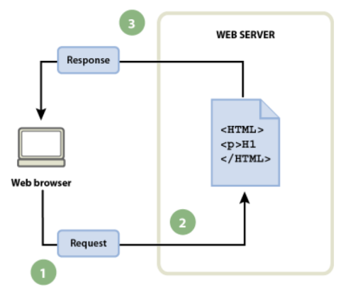

1. ¿Qué es una página web?
    
    Es un conjunto de información que se encuentra en una dirección determinada de internet.

2. ¿Qué es un sitio web?

    Es un espacio virtual que contiene toda la información que una persona o empresa quiere difundir a través de internet.

3. ¿Qué es una aplicación web?

    Las aplicaciones web son programas informáticos que se ejecutan en un servidor web.

4. ¿Qué es una herramienta ofimática?

    Es una aplicación (en local o en linea) que permite editar un texto, una hoja de cálculo, una
    presentación

5. [Herramientas de Google](https://www.google.com/intl/es-419/chrome/browser-tools/)

    | Aplicaciones | Visto |
    | --- | --- |
    | Google Docs |:heavy_check_mark:|
    | Google Slides|:heavy_check_mark:|
    | Google Sheets|:heavy_check_mark:|
    | Google Calendar|:calendar: |
    | Google Meet|:computer: |
    | ... |... |

6. ¿Qué es ``HTML``?

    Es un lenguaje de marcas. Es el lenguaje estandard para crear sitios web.

````html
  <!DOCTYPE html>
  <html lang="en">
  <head>
    <meta charset="UTF-8">
    <meta http-equiv="X-UA-Compatible" content="IE=edge">
    <meta name="viewport" content="width=device-width, initial-scale=1.0">
    <title>Document</title>
  </head>
  <body>
    
  </body>
  </html>
````

7. ¿Qué es ```CSS```?

   CSS es un lenguaje usado para dar estilo a un documento HTML. CSS describe como los
   elementos HTML deberían ser mostrados.

8. Flujo de trabajo (navegador, petición, servidor y respuesta):

      
